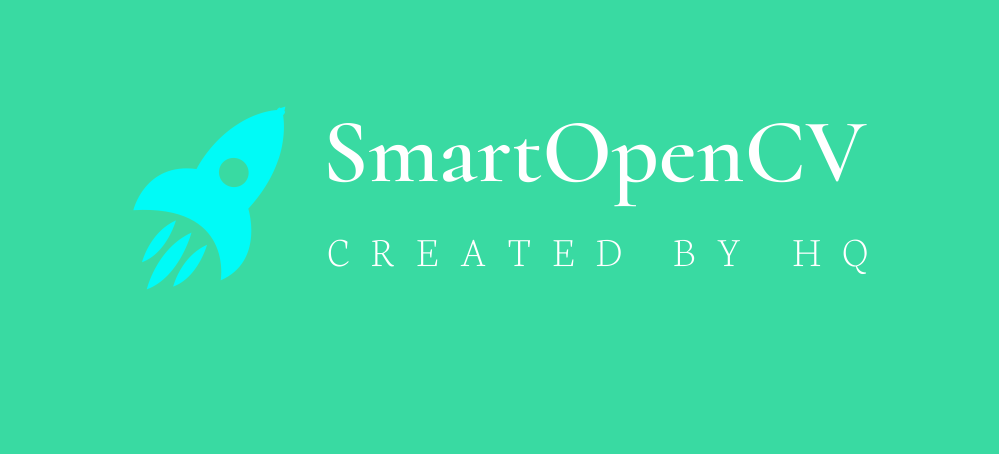
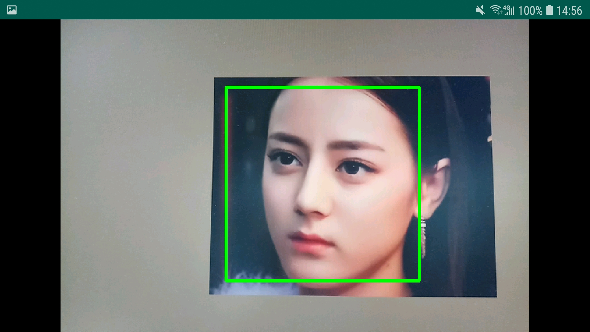
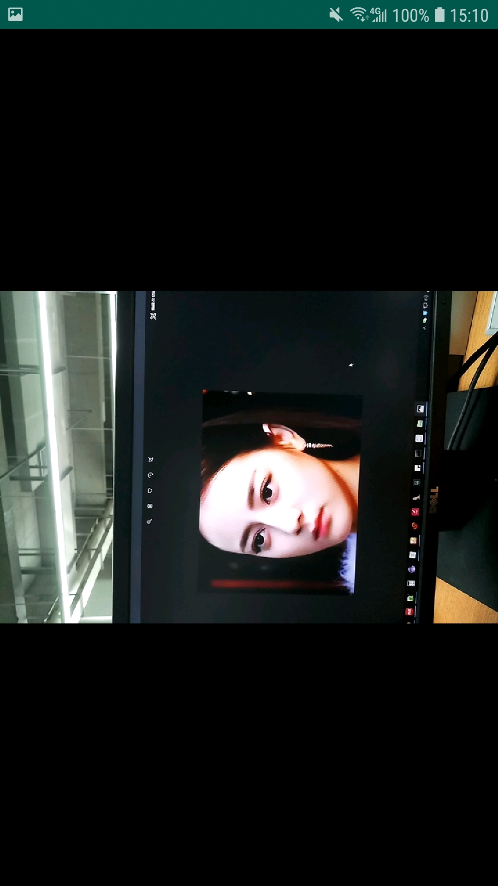
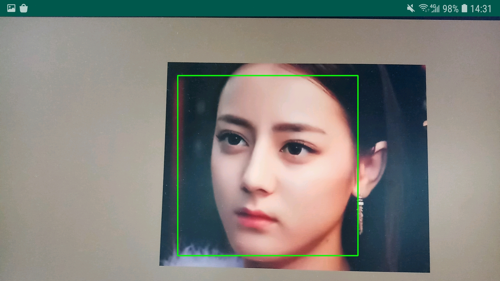
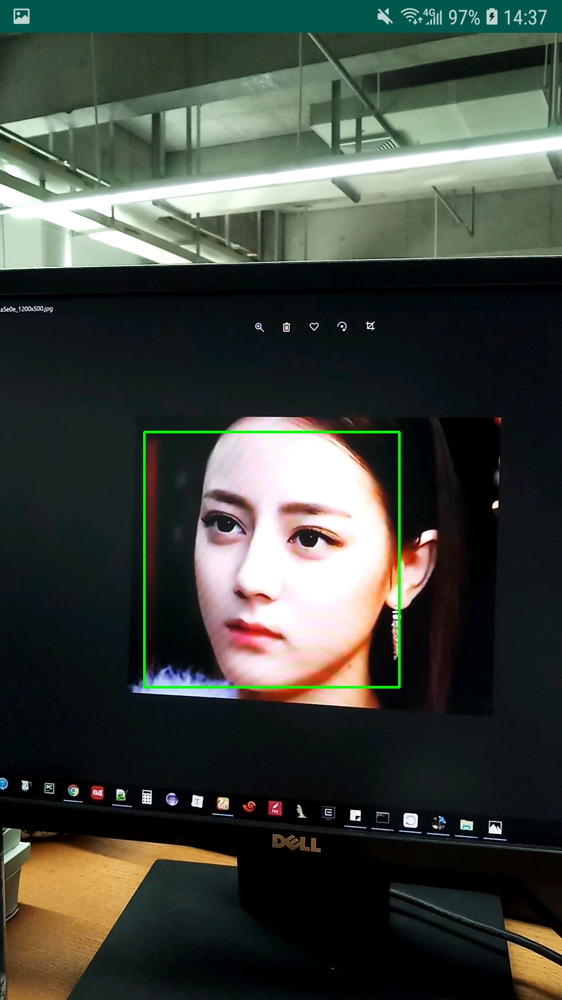

# SmartOpenCV

  
### 前言

:fire: :fire: :fire: 随着人工智能的快速发展以及终端设备硬件水平的不断提升，在终端设备上直接运行智能系统成为可能，端侧智能具备低延时，隐私安全等特点。同时降低了云端智能存在的网络传输不可靠风险，使得端侧智能越来越得到重视。端侧智能比较成熟的领域就是NLP以及CV。在CV领域OpenCV作为开源且强大的跨平台计算机视觉库，在图像处理以及图像识别方向得到了广泛应用。但是在Android平台OpenCV官方SDK在图像预览方面存在诸多缺陷。

### SmartOpenCV是什么
SmartOpenCV是一个OpenCV在Android端的增强库，解决了OpenCV Android SDK在图像预览方面存在的诸多问题，而且无需修改OpenCV SDK源码，与OpenCV的SDK解耦，只需替换xml中原OpenCV的`JavaCameraView`/`JavaCamera2View`即可达到具备OpenCV官方SDK的原功能以及SmartOpenCV的增强功能。

### OpenCV官方SDK存在的问题

OpenCV Android端SDK虽然很容易上手和使用，但是预览存在很多问题，常见问题如下：

- **默认横屏显示，且无法通过接口修改预览方向**

- **预览绘制存在黑边**：OpenCV默认绘制算法在绘制预览帧图像到Canvas时存在一定的偏移，在视觉上表现就是预览帧只会占SurfaceView控件的一部分区域，偏移部分区域会显示为黑色

  ```java
  if (mScale != 0) {
      canvas.drawBitmap(mCacheBitmap, new Rect(0, 0, mCacheBitmap.getWidth(), mCacheBitmap.getHeight()),
              new Rect((int) ((canvas.getWidth() - mScale * mCacheBitmap.getWidth()) / 2),
                      (int) ((canvas.getHeight() - mScale * mCacheBitmap.getHeight()) / 2),
                      (int) ((canvas.getWidth() - mScale * mCacheBitmap.getWidth()) / 2 + mScale * mCacheBitmap.getWidth()),
                      (int) ((canvas.getHeight() - mScale * mCacheBitmap.getHeight()) / 2 + mScale * mCacheBitmap.getHeight())), null);
  } else {
      canvas.drawBitmap(mCacheBitmap, new Rect(0, 0, mCacheBitmap.getWidth(), mCacheBitmap.getHeight()),
              new Rect((canvas.getWidth() - mCacheBitmap.getWidth()) / 2,
                      (canvas.getHeight() - mCacheBitmap.getHeight()) / 2,
                      (canvas.getWidth() - mCacheBitmap.getWidth()) / 2 + mCacheBitmap.getWidth(),
                      (canvas.getHeight() - mCacheBitmap.getHeight()) / 2 + mCacheBitmap.getHeight()), null);
  }
  ```

  

- **预览帧大小选择算法不符合实际场景要求**：对于预览帧大小的选择，OpenCV默认算法是选择**小于**预览控件(或设置的最大帧大小)的最大预览，这将导致在很多情况下预览图像的显示不能铺满整个控件甚至远小于控件大小， 在绝大部分业务场景下，这种算法不能满足实际需求

  ```java
  protected Size calculateCameraFrameSize(List<?> supportedSizes, ListItemAccessor accessor, int surfaceWidth, int surfaceHeight) {
          int calcWidth = 0;
          int calcHeight = 0;
  
          int maxAllowedWidth = (mMaxWidth != MAX_UNSPECIFIED && mMaxWidth < surfaceWidth)? mMaxWidth : surfaceWidth;
          int maxAllowedHeight = (mMaxHeight != MAX_UNSPECIFIED && mMaxHeight < surfaceHeight)? mMaxHeight : surfaceHeight;
  
          for (Object size : supportedSizes) {
              int width = accessor.getWidth(size);
              int height = accessor.getHeight(size);
              Log.d(TAG, "trying size: " + width + "x" + height);
  
              if (width <= maxAllowedWidth && height <= maxAllowedHeight) {
                  if (width >= calcWidth && height >= calcHeight) {
                      calcWidth = (int) width;
                      calcHeight = (int) height;
                  }
              }
          }
          if ((calcWidth == 0 || calcHeight == 0) && supportedSizes.size() > 0)
          {
              Log.i(TAG, "fallback to the first frame size");
              Object size = supportedSizes.get(0);
              calcWidth = accessor.getWidth(size);
              calcHeight = accessor.getHeight(size);
          }
  
          return new Size(calcWidth, calcHeight);
      }
  ```

  


### SmartOpenCV的特点

- **易使用**：如果你项目中之前使用的是OpenCV的官方SDK，那么引入SmartOpenCV后只需将xml文件中的`JavaCameraView`/`JavaCamera2View`替换为SmartOpenCV的`CamerPreview`/`Camera2Preview`即可达到与使用官方SDK相同的效果

- **功能增强**：
  1. 预览自适应：自动根据前后摄像头，横竖屏以及不同摄像头参数来调整与适配预览方向以及大小，开发者无需写任何额外代码
  2. 可扩展预览绘制算法：SmartOpenCV内置了一种默认的预览帧绘制算法，同时提供策略接口让开发者根据自己的业务场景自定义预览绘制算法
  3. 可扩展预览帧大小选择算法：SmartOpenCV内置了一种默认的预览帧大小计算算法，同时提供策略接口让开发者根据自己的业务自定义预览帧大小计算算法
  
- **提供更友好的API接口**：在继承OpenCV官方接口的同时，SmartOpenCV将众多繁杂操作统一通过CameraConfiguration来配置，提供更友好的Fluent API接口，让开发者能够更灵活的控制预览显示相关参数与配置

- **不直接依赖官方SDK，方便升级官方SDK**：与OpenCV官方SDK解耦，只要官方SDK内部核心逻辑未做修改，那么SmartOpenCV可以兼容所有版本的官方SDK，使用SmartOpenCV后如果以后打算升级依赖的OpenCV为更新版本，只需将OpenCV的依赖更新为新版本即可，代码无需做任何改动

### 效果对比
#### 以人脸识别为例

|            | 横屏                                                         | 竖屏   |
| ---------- | ------------------------------------------------------------ | ------ |
| OpenCV | <div align=center>**即使宽与高都设置为match_parent也无法全屏，存在黑边**  </div>  |<div align=center> **存在黑边，且默认不支持竖屏**  </div>  |
| SmartOpenCV | <div align=center></div> | <div align=center></div> |

### Demo对比体验
[smartopencv-app-debug.apk](demo/smartopencv-app-debug.apk)  
[opencv-app-debug.apk](demo/opencv-app-debug.apk)  

### Usage

#### 基础用法

在项目中需要使用预览的xml中用SmartOpenCV的`CameraPreview`/`Camera2Preview`替换OpenCV的`JavaCameraView`/`JavaCamera2View`即可，就这么简单，其余的什么都不用做

```xml
<LinearLayout xmlns:android="http://schemas.android.com/apk/res/android"
    android:layout_width="match_parent"
    android:layout_height="match_parent">

    <!--<org.opencv.android.JavaCameraView-->
    <!--android:id="@+id/fd_activity_surface_view"-->
    <!--android:layout_width="match_parent"-->
    <!--android:layout_height="match_parent" />-->

    <tech.huqi.smartopencv.core.preview.CameraPreview
        android:id="@+id/fd_activity_surface_view"
        android:layout_width="match_parent"
        android:layout_height="match_parent" />
</LinearLayout>
```

#### 高级用法

如果打算通过SmartOpenCV提供的接口来更灵活的控制预览显示相关参数与配置，那么调用`SmartOpenCV.getInstance().init()`传入前面获取的预览控件对象即可，用法如下：

```java
SmartOpenCV.getInstance().init(mOpenCvCameraView, new CameraConfiguration.Builder()
                    .debug(true)
                    .cameraIndex(0)  // 设置摄像头索引,主要用于多摄像头设备，优先级低于frontCamera
                    .keepScreenOn(false) // 是否保持屏幕常亮
                    .frontCamera(false)  // 是否使用前置摄像头
                    .openCvDefaultDrawStrategy(false) // 是否使用OpenCV默认的预览图像绘制策略
                    .openCvDefaultPreviewCalculator(false) // 是否使用OpenCV默认的预览帧大小计算策略
                    .landscape(false) // 是否横屏显示
                    .allowedScreenOrientationSwitch(true)
                    .maxFrameSize(400, 300) // 设置预览帧的最大大小
                    .cvCameraViewListener(this) // 设置OpenCV回调监听器
                    .previewSizeCalculator(new IPreviewSizeCalculator() { // 自定义预览帧大小计算策略
                        @Override
                        public Size calculateCameraFrameSize(List<Size> supportedSizes, int surfaceWidth, int surfaceHeight) {
                            return null; // 若需要根据自己的具体业务场景改写览帧大小，覆写该方法逻辑
                        }
                    })
                    .drawStrategy(new IDrawStrategy() { // 自定义绘制策略
                        @Override
                        public void drawBitmap(Canvas canvas, Bitmap frameBitmap, int surfaceWidth, int surfaceHeight, boolean isSetLandscape, boolean isPortrait) {
                            // 若需根据自己的具体业务场景绘制预览帧图像，覆写该方法逻辑
                        }
                    })
                    .build());
```


### LICENSE
[LICENSE](LICENSE)  

### 公众号
  
